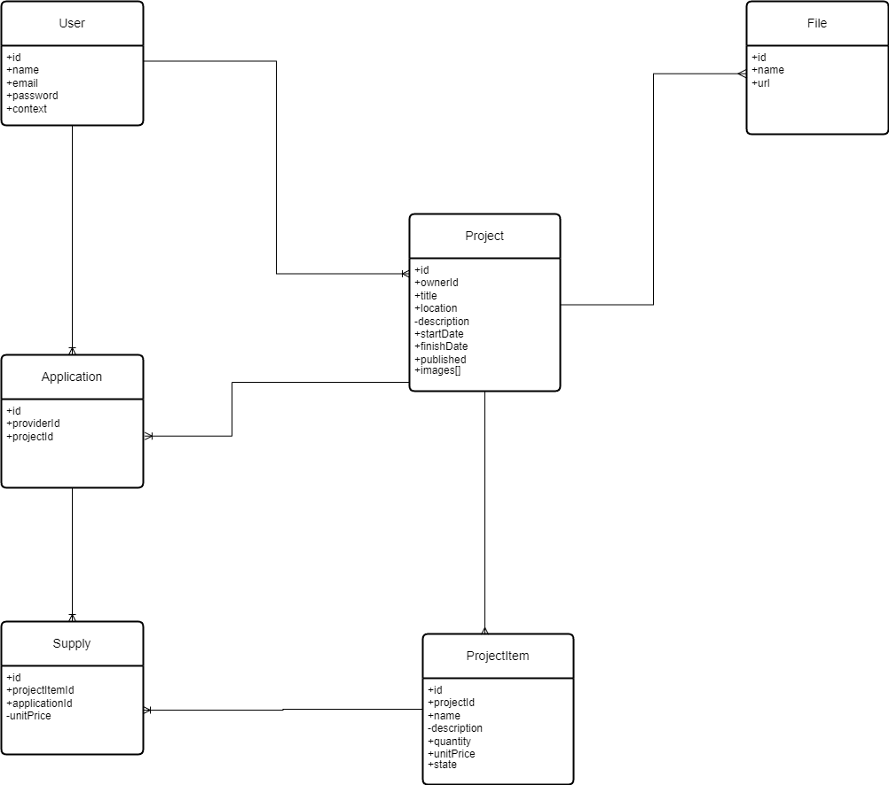

# Construction API

This is a REST API built to solve the requirement of a business where constructor users register projects and provider users apply to them

## Project Philosophy

This project was built following CLEAN architecture principles, with hexagonal architecture. This means that dependency inversion is combined with dependency injection to isolate 3rd party specifics from core logic.

## Packages / Libraries used

- Mongoose to interact with MongoDB
- Firebase to store images
- Passport / Passport JWT to simplify auth flows
- Class transformer / Class validators to enforce validations on incoming DTOs

## Database

Checkout public folder for database diagram

